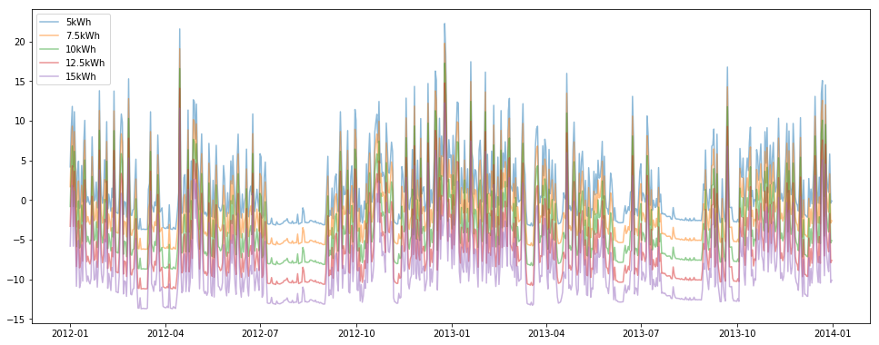
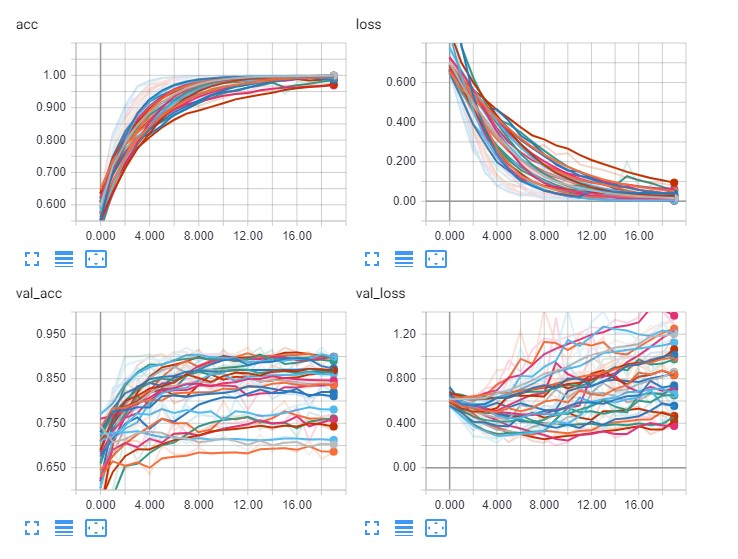

# Energy Modelling

## Getting started
To set up a conda environment with correct versions of modules use
`conda env create -f environment.yml` inside of directory.

To activate the environment in conda use `source activate primary` for Linux and OSX and `activate primary` on Windows.

To launch Jupyter Notebooks use `jupyter notebook`.

## Sections
### 1. Energy Consumption Singular RNN GRU Model - Jupyter Notebook
A time series prototype of an RNN using GRU to predict household energy consumption patterns on a singular series of data.

### 2. Energy Consumption Singular ARIMA Model - Jupyter Notebook
A time series prototype of an ARIMA model to predict household energy consumption patterns on a singular series of data.

### 3. Energy Consumption Battery Supplement Model - Jupyter Notebook
A statistical model of energy consumption displacement when supplemented by battery storage at various sizes.

### 4. Energy Meters Recognition CNN Model - Jupyter Notebook
A CNN that recognises meter readings over non meter readings over different gas and electric meter types. Logic to run 27 variations of the model consecutively, Augmentor used to supplement the training data and Pickle used to save data manipulation.
