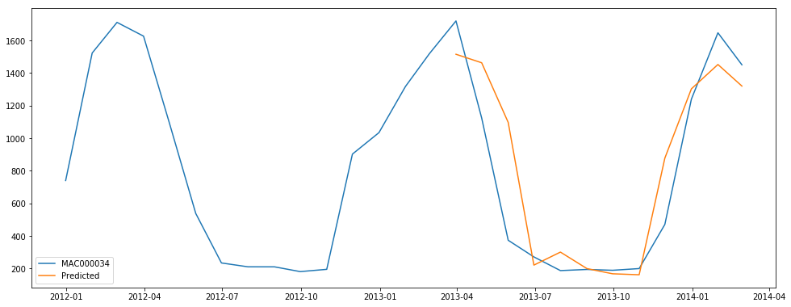

# Modelling Microgrids

## Getting started
To set up a conda environment with correct versions of modules use
`conda env create -f environment.yml` inside of directory.

To activate the environment in conda use `source activate primary` for Linux and OSX and `activate primary` on Windows.

To launch Jupyter Notebooks use `jupyter notebook`.

## Sections
### Energy Consumption Singular Model Prototype - Jupyter Notebook
A time series prototype of an RNN using GRU to predict household energy consumption patterns on a singular series of data.
